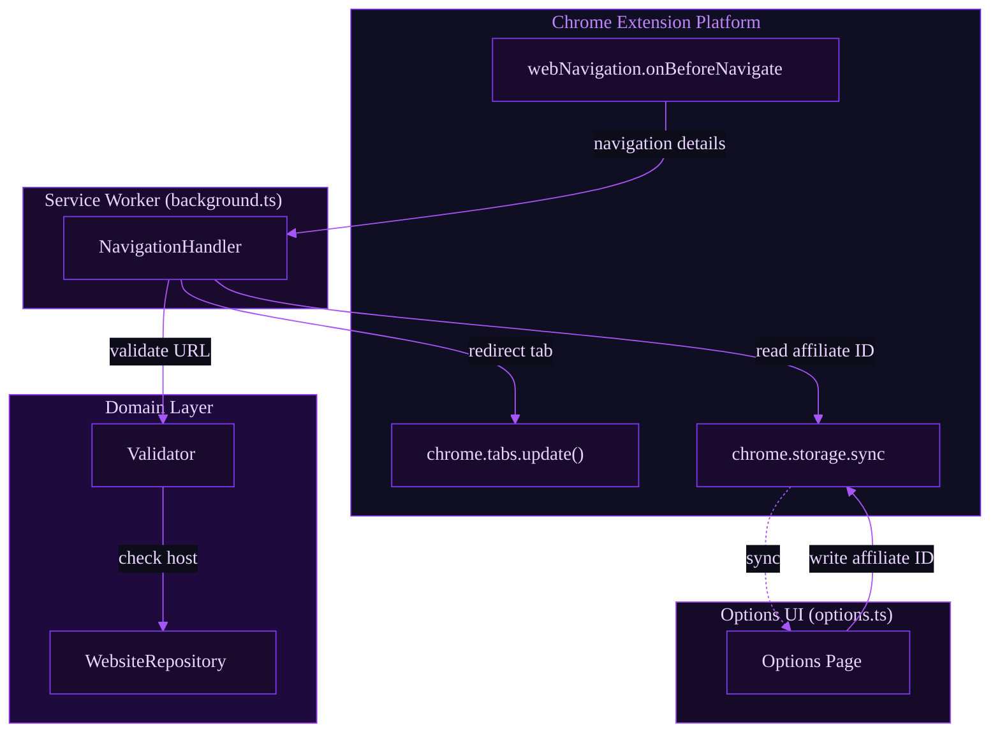
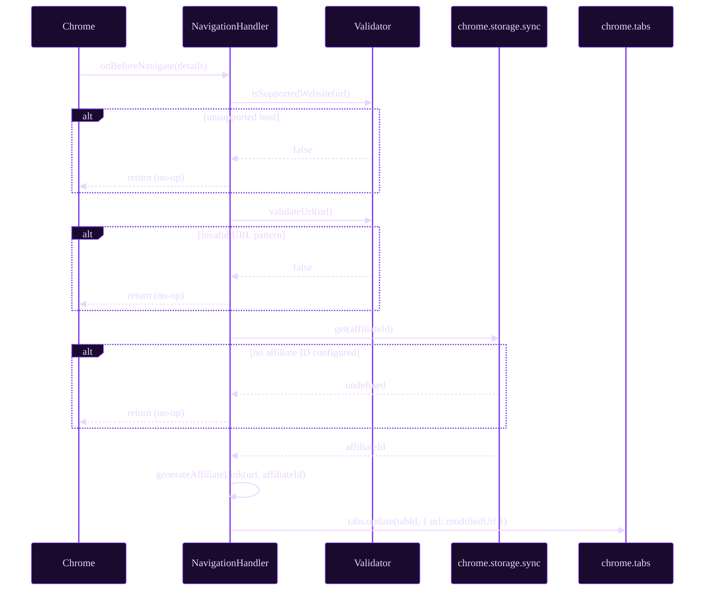
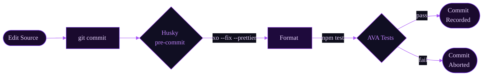
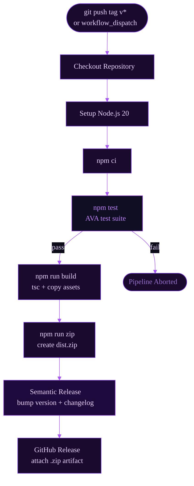

<p align="center">
  
</p>

<p align="center">
  <a href="https://github.com/simwai/chrome-extension-template/releases"></a>
  <a href="https://github.com/simwai/chrome-extension-template/actions/workflows/release.yml"></a>
  <a href="https://opensource.org/licenses/MIT"></a>
  
  
  <a href="https://github.com/xojs/xo"></a>
</p>

---

A **production-ready scaffold** for building Chrome extensions with Manifest V3, strict TypeScript, automated testing, and a full CI/CD release pipeline. Skip the boilerplate — fork this, rename the extension, and ship.

> This template is extracted from [referral-link-inserter](https://github.com/simwai/referral-link-inserter), a real-world Chrome extension, so every architectural decision is battle-tested against the Chrome extension platform's quirks.

---

## Table of Contents

- [Why This Template](#why-this-template)
- [Architecture](#architecture)
- [Project Structure](#project-structure)
- [Core Design Decisions](#core-design-decisions)
  - [Manifest V3 + Service Worker](#manifest-v3--service-worker)
  - [Strict TypeScript](#strict-typescript)
  - [Testability via Dependency Injection](#testability-via-dependency-injection)
  - [Separation of Concerns](#separation-of-concerns)
  - [Options Page with Chrome Storage Sync](#options-page-with-chrome-storage-sync)
- [Workflows](#workflows)
  - [Development Workflow](#development-workflow)
  - [Release Workflow](#release-workflow)
- [Getting Started](#getting-started)
  - [Prerequisites](#prerequisites)
  - [Installation](#installation)
  - [Development](#development)
  - [Testing](#testing)
  - [Load in Chrome](#load-in-chrome)
- [Customization Guide](#customization-guide)
- [Contributing](#contributing)
- [License](#license)

---

## Why This Template

Most Chrome extension starters are either too minimal (a bare `manifest.json` with vanilla JS) or too heavy (full React/Webpack setups that obscure the extension platform itself). This template sits at the right level of abstraction:

| Concern | Solution |
|---|---|
| Browser API isolation | `chrome` injected as a constructor dependency — fully mockable in tests |
| Type safety | Strict TypeScript via `@sindresorhus/tsconfig` — no `any` escape hatches |
| Code quality | XO (ESLint + Prettier unified) enforced on commit via Husky |
| Testing | AVA with concurrent test execution and TypeScript-native compilation |
| Build | Plain `tsc` — no bundler complexity unless your use case demands it |
| Release | Semantic Release + GitHub Actions — automated versioning and ZIP artifacts |

The goal is a scaffold where every file has a reason to exist and every tool earns its place.

---

## Architecture

The extension separates concerns across three distinct layers: the **background service worker** (event-driven, long-running logic), the **domain layer** (pure business logic, fully testable), and the **options UI** (user configuration persisted via Chrome Storage).



### Navigation Event Flow



---

## Project Structure

```
chrome-extension-template/
├── .github/
│   ├── assets/
│   │   └── banner.svg              # Repository banner
│   └── workflows/
│       └── release.yml             # CI/CD: test → build → release
├── .husky/
│   └── pre-commit                  # Format + test gate before every commit
├── .vscode/
│   ├── extensions.json             # Recommended workspace extensions
│   └── settings.json               # Editor settings aligned with XO/Prettier
├── src/
│   ├── favicons/                   # Extension icons (16px – 256px)
│   ├── tests/
│   │   ├── navigation-handler.test.ts      # Unit tests (mocked chrome APIs)
│   │   ├── navgation-handler.int.test.ts   # Integration tests
│   │   ├── validator.test.ts
│   │   ├── website-repository.test.ts
│   │   └── test-types.ts           # Shared test type helpers
│   ├── background.ts               # Service worker entry point
│   ├── manifest.json               # Extension manifest (MV3)
│   ├── navigation-handler.ts       # Core navigation interception logic
│   ├── options.html                # Options page markup
│   ├── options.ts                  # Options page logic (storage read/write)
│   ├── types.ts                    # Shared domain types
│   ├── validator.ts                # URL validation rules
│   └── website-repository.ts       # Supported websites registry
├── .gitignore
├── CONTRIBUTING.md
├── LICENSE.md
├── package.json
├── tailwind.config.css             # CSS configuration (options UI)
└── tsconfig.json
```

---

## Core Design Decisions

### Manifest V3 + Service Worker

Chrome's Manifest V3 replaces persistent background pages with **service workers** — ephemeral event-driven processes that terminate when idle. This has significant implications:

- No in-memory state between events — all persistent state lives in `chrome.storage`
- The service worker registers event listeners synchronously at the top level; async listeners must be registered before any `await`

The template models this correctly: `background.ts` registers the `webNavigation.onBeforeNavigate` listener synchronously, while async work (storage reads, URL generation) happens inside the handler.

```typescript
// Correct — listener registered synchronously
chrome.webNavigation.onBeforeNavigate.addListener(
  async (details) => { await navigationHandler.handleNavigation(details) },
  { url: websitesData },
)
```

The `{ url: websitesData }` filter is passed directly to the listener registration, which means Chrome only fires the event for matching hosts — reducing unnecessary service worker wakeups.

---

### Strict TypeScript

The project extends [`@sindresorhus/tsconfig`](https://github.com/sindresorhus/tsconfig), which enables the full strictness suite. Combined with XO's TypeScript rules, this surfaces type errors that would otherwise silently produce incorrect runtime behavior in the Chrome API's loosely-typed surfaces.

Domain types are centralized in `types.ts`, preventing type drift between the manifest host list, the background entry point, and the repository layer.

---

### Testability via Dependency Injection

The biggest challenge in testing Chrome extensions is that the `chrome` global is only available in the extension context — not in Node.js (where AVA runs). This template solves it with a straightforward constructor injection pattern:

```typescript
// NavigationHandler accepts chrome as a dependency
export class NavigationHandler {
  public readonly chrome: any
  constructor(websitesData: WebsiteData[], chrome: any) { ... }
}

// In tests — inject sinon stubs instead
const chromeMock = { storage: { sync: { get: sinon.stub() } }, tabs: { update: sinon.stub() } }
const handler = new NavigationHandler(websitesData, chromeMock)
```

`background.ts` wires the real `chrome` global only when running inside the extension:

```typescript
if (typeof chrome !== 'undefined') {
  const navigationHandler = new NavigationHandler(websitesData, chrome)
  ...
}
```

This guard makes the module safely importable in the test environment without side effects.

---

### Separation of Concerns

The domain logic is split across three focused classes, each with a single responsibility:

| Class | Responsibility |
|---|---|
| `WebsiteRepository` | Owns the list of supported hosts; maps `WebsiteData[]` to `string[]` |
| `Validator` | Encodes URL validity rules; depends on `WebsiteRepository` but knows nothing about Chrome |
| `NavigationHandler` | Orchestrates the event flow; depends on both, plus the Chrome API |

This layering means validation rules and host lists are testable in pure Node.js, while only the orchestration layer interacts with Chrome APIs. Adding a new supported website requires only a single change in `background.ts` — the rest propagates automatically.

---

### Options Page with Chrome Storage Sync

User configuration is persisted via `chrome.storage.sync`, which replicates settings across the user's Chrome profile on other devices. The options page reads on `DOMContentLoaded` and writes on every input event — no save button required, which aligns with Chrome's extension UX guidelines.

The `options.ts` exports are deliberately async (`saveOptions`, `restoreOptions`, `handleInputChange`) to accommodate the asynchronous Chrome Storage API without blocking the UI thread.

---

## Workflows

### Development Workflow



Husky enforces two gates on every commit: **auto-formatting** (so no code review feedback about style) and **tests** (so broken code never lands on any branch).

### Release Workflow

Releasing is triggered by pushing a version tag (`v*`) or dispatching the workflow manually. GitHub Actions handles the full pipeline:



The ZIP artifact produced by `bestzip` is uploaded directly to the GitHub Release, ready for manual submission to the Chrome Web Store or sideloading during development.

---

## Getting Started

### Prerequisites

- **Node.js** ≥ 20
- **npm** ≥ 10
- **Google Chrome** (for loading the unpacked extension)

### Installation

```bash
# Clone the template
git clone https://github.com/simwai/chrome-extension-template.git my-extension
cd my-extension

# Remove template git history and start fresh
rm -rf .git && git init

# Install dependencies
npm ci
```

### Development

```bash
# Build (TypeScript compile + copy static assets to dist/)
npm run build

# Watch mode — rebuild on file changes (requires tsx or tsc --watch)
npx tsc --watch
```

### Testing

The test suite uses [AVA](https://github.com/avajs/ava) with concurrency enabled. Tests compile via `tsc` before execution — no separate transpilation step needed.

```bash
# Run all tests
npm test

# Run tests in a specific file
npx ava src/tests/navigation-handler.test.ts
```

Tests are structured in two layers:

- **Unit tests** (`*.test.ts`) — isolated per class, chrome APIs fully mocked with Sinon
- **Integration tests** (`*.int.test.ts`) — multiple classes wired together, only external APIs mocked

### Load in Chrome

1. Run `npm run build` to populate the `dist/` directory
2. Open `chrome://extensions` in Chrome
3. Enable **Developer mode** (top-right toggle)
4. Click **Load unpacked** and select the `dist/` folder
5. The extension is now active — edit source files, rebuild, and click the reload icon to update

---

## Customization Guide

| What to change | Where |
|---|---|
| Extension name, version, permissions | `src/manifest.json` |
| Supported host patterns | `src/background.ts` → `websitesData` array and `manifest.json` → `host_permissions` |
| Core navigation logic | `src/navigation-handler.ts` → `handleNavigation()` |
| URL validation rules | `src/validator.ts` |
| Options UI fields | `src/options.html` + `src/options.ts` |
| Release ZIP filename | `package.json` → `scripts.zip` |
| CI/CD Node version | `.github/workflows/release.yml` |

When extending `WebsiteData` with new fields (e.g., per-domain configuration), update `src/types.ts` first — TypeScript will surface every call site that needs updating.

---

## Contributing

Contributions are welcome. Please read [CONTRIBUTING.md](CONTRIBUTING.md) before opening a pull request.

Key points:

- All commits must pass the Husky pre-commit hook (format + tests)
- New features should include corresponding unit tests in `src/tests/`
- Follow the existing class/interface patterns — prefer dependency injection over global access
- Use conventional commit messages (`feat:`, `fix:`, `chore:`) to enable Semantic Release changelog generation

---

## License

This project is licensed under the **MIT License** — see [LICENSE.md](LICENSE.md) for details.
