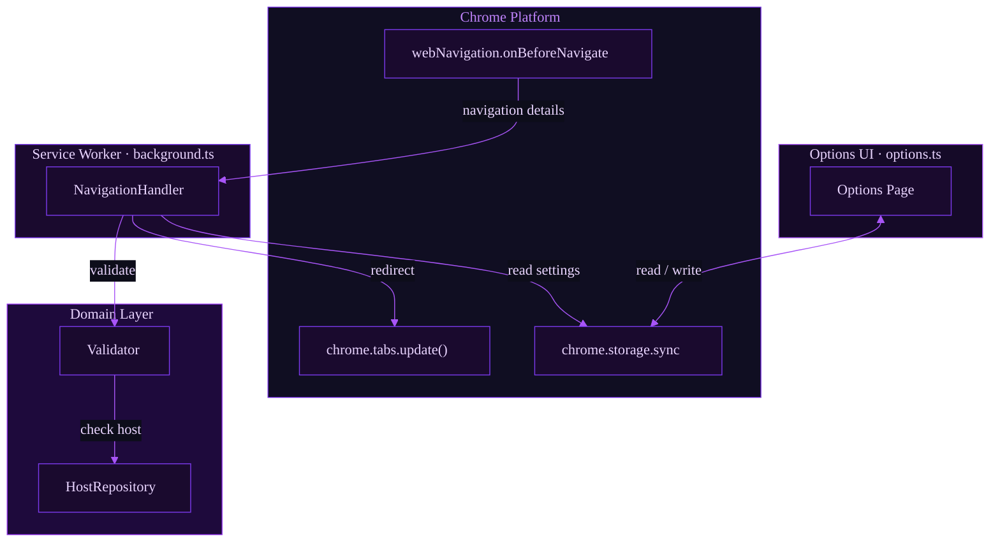
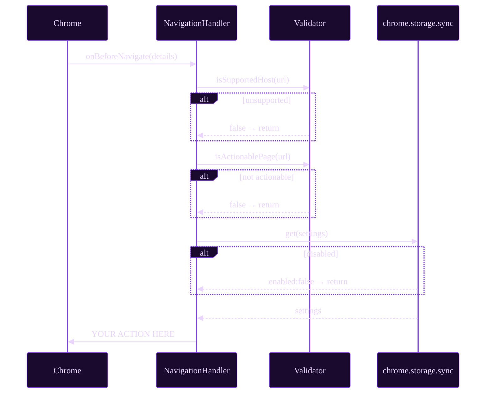
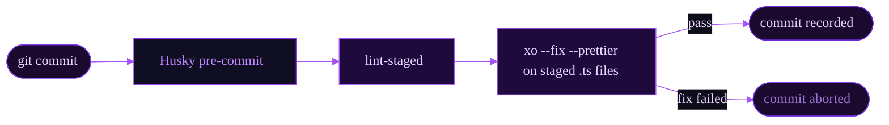
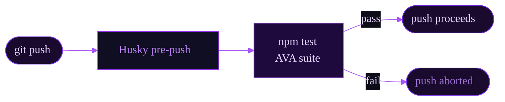
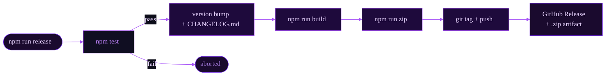

<p align="center">
  
</p>

<p align="center">
  <a href="https://github.com/simwai/chrome-extension-template/releases"></a>
  <a href="https://opensource.org/licenses/MIT"></a>
  
  
  <a href="https://github.com/xojs/xo"></a>
</p>

---

A minimal, opinionated scaffold for Chrome extensions. It provides the architecture, toolchain, and CI/CD pipeline — you provide the logic.

## What's included

| Concern | Solution |
|---|---|
| Extension platform | Manifest V3, service worker entry point |
| Language | Strict TypeScript via `@sindresorhus/tsconfig` |
| Testing | AVA with concurrent execution, Sinon for chrome API mocks |
| Code quality | XO (ESLint + Prettier in one) via lint-staged on every commit |
| Build | Plain `tsc` — no bundler, no hidden magic |
| Release | release-it — bump, changelog, tag, GitHub release + ZIP, all local |

## Architecture

Three layers, each independently testable:



### Navigation event flow



## Project structure

```
chrome-extension-template/
├── .github/
│   └── assets/banner.svg
├── .husky/
│   ├── pre-commit               # lint-staged: format staged .ts files
│   └── pre-push                 # full test suite before any push
├── .release-it.json             # release-it: bump, changelog, tag, GitHub release
├── src/
│   ├── tests/
│   │   ├── host-repository.test.ts
│   │   ├── navigation-handler.test.ts
│   │   ├── validator.test.ts
│   │   └── test-types.ts
│   ├── background.ts            # service worker entry point
│   ├── host-repository.ts       # supported host registry
│   ├── manifest.json
│   ├── navigation-handler.ts    # core event logic — inject your action here
│   ├── options.html
│   ├── options.ts               # settings UI (chrome.storage.sync)
│   ├── types.ts                 # shared domain types
│   └── validator.ts             # URL validation rules
├── CONTRIBUTING.md
├── package.json
├── tsconfig.json
└── LICENSE.md
```

## Getting started

### Prerequisites

- Node.js ≥ 20
- Google Chrome

### Install

```bash
# Use this repo as a GitHub template, then clone your new repo:
git clone https://github.com/<you>/<your-extension>.git
cd <your-extension>
npm ci
```

### Develop

```bash
npm run build       # tsc → dist/
npm test            # AVA test suite
npm run format      # XO auto-fix + Prettier (whole project)
```

### Load in Chrome

1. `npm run build`
2. Open `chrome://extensions`, enable **Developer mode**
3. **Load unpacked** → select the `dist/` folder

## Customisation

Work through these files in order:

1. **`src/manifest.json`** — set name, description, `host_permissions`, and any additional `permissions`
2. **`src/types.ts`** — define your domain types and `UserSettings` shape
3. **`src/background.ts`** — replace the `hosts` array with your target hosts
4. **`src/validator.ts`** — implement `isActionablePage()` with your URL rules
5. **`src/navigation-handler.ts`** — replace the `TODO` in `handleNavigation()` with your core logic
6. **`src/options.html` + `src/options.ts`** — add your settings fields and storage keys
7. **`src/tests/`** — update tests to cover your validation rules and handler logic

## Workflows

### Commit

lint-staged runs on `pre-commit` and only processes staged `.ts` files — fast and scoped.



### Push

The full test suite runs on `pre-push` — a heavier gate that runs once before the branch leaves your machine.



### Release

Releases run entirely from your local machine via `npm run release`. No CI secrets, no pipeline to wait for.



Before your first release, export a GitHub token with `repo` scope:

```bash
export GITHUB_TOKEN=ghp_yourtoken
npm run release
```

release-it reads `.release-it.json` and handles: conventional changelog generation → version bump → `npm run build` → `npm run zip` → git tag → GitHub Release with the `.zip` attached.

## Design decisions

**Why dependency injection for `chrome`?**
The `chrome` global only exists inside the extension runtime. Injecting it as a constructor argument lets every class that touches Chrome APIs be instantiated and tested in Node.js with Sinon stubs — no special test environment or polyfill needed.

**Why no bundler?**
Plain `tsc` keeps the build transparent and the output readable. Manifest V3 service workers support ES modules natively, so a bundler adds complexity without benefit for most extensions. Add one (Vite, esbuild) when you need tree-shaking across large dependency graphs.

**Why XO over raw ESLint?**
XO bundles ESLint, Prettier, and a curated ruleset into a single dependency with a minimal config surface. One `npm run format` command handles both linting and formatting.

**Why `chrome.storage.sync` over `localStorage`?**
`sync` replicates settings across all of the user's Chrome profiles automatically, and is accessible from service workers where `localStorage` is not available.

**Why lint-staged instead of running XO on the whole project pre-commit?**
Running the linter over every file on each commit is slow in large projects. lint-staged scopes XO to only the files in the current staging area — sub-second feedback regardless of project size.

**Why release-it instead of semantic-release?**
semantic-release is built to run in CI and requires a token-bearing environment to push tags and create releases. release-it is designed for local execution — one command, interactive prompts, no pipeline dependency.

## Contributing

See [CONTRIBUTING.md](CONTRIBUTING.md).

## License

[MIT](LICENSE.md)
